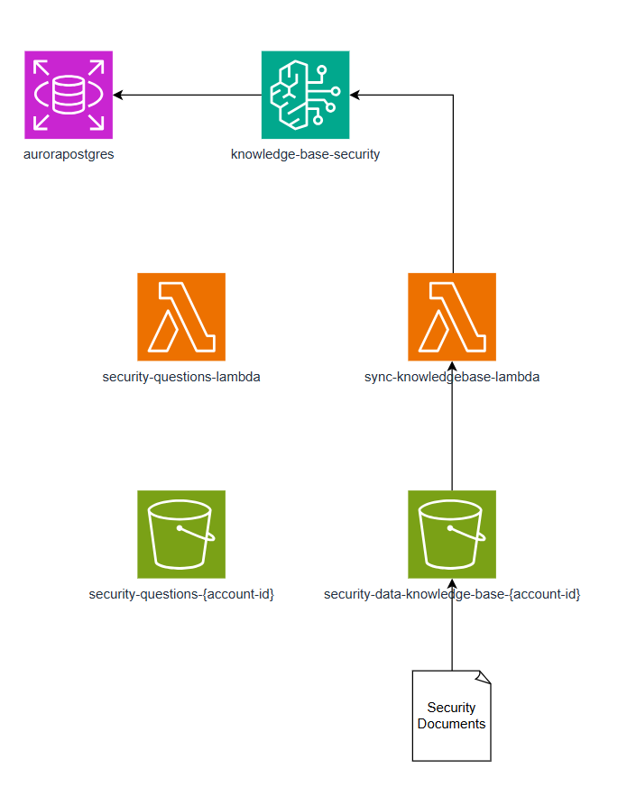
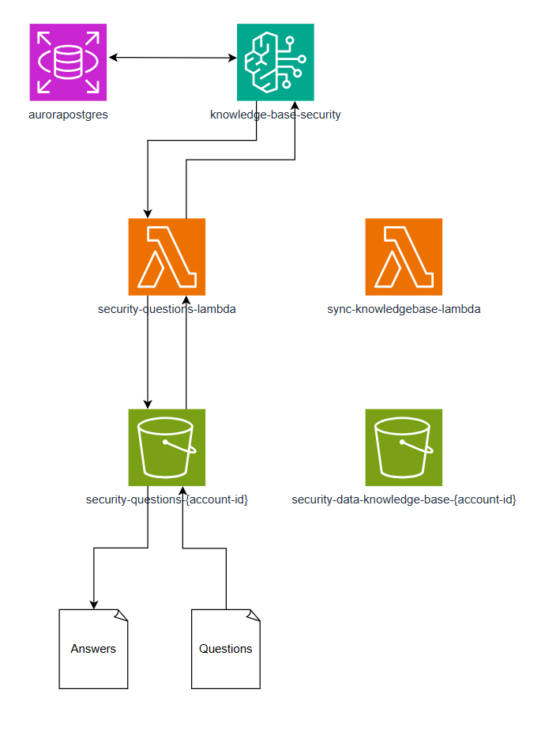

# bedrock-secure-questionnaire-automation
Infrastructure-as-code for a serverless knowledge base using Amazon Bedrock, Aurora PostgreSQL (with pgvector), Lambda, and S3. This setup ingests domain-specific data into a Bedrock Knowledge Base for retrieval-augmented generation (RAG) and handles automated question answering.

## How it works
- Aurora PostgreSQL (with pgvector)

  -  Version 8.5 allowing min capacity 0 to reduce costs to $0 when idle.
  - Stores your security documents and policies as vectors for quick similarity search.

- Amazon Bedrock

  - Handles retrieval + generation (RAG) based on your knowledge base stored in Aurora.
  - You can specify which LLM ARN to use in variables.tf (e.g., Anthropic Claude, Amazon Titan, etc.).

- AWS Lambda + S3

  - **Ingestion Lambda:** Watches for new files in the security-data-knowledge-base-* S3 bucket; updates your knowledge base.
  - **Question-Answer Lambda:** Watches for new text files in the security-questions-* S3 bucket (specifically in the Questions/ folder), then calls Bedrock to answer those questions.
 
  ## Usage

1. **Clone the repository**:
   ```bash
   git clone https://github.com/adanalvarez/bedrock-secure-questionnaire-automation.git
   cd bedrock-secure-questionnaire-automation
   ```
2. **Review & Update Variables**:
  - Open variables.tf and adjust:
    - aws_region (e.g., us-east-1)
    - database_name
    - model_arn_base (to change the LLM model, e.g., Anthropic Claude, Amazon Titan, etc.)
    - Any other settings, like vpc_name
  - You can also use a .tfvars file if you prefer.

3. **Initialize & Deploy**:
   ```bash
   terraform init
   terraform plan
   terraform apply
   ```

4. **Verify Deployment**:
- Terraform creates:
  - An Aurora PostgreSQL (Serverless v2) cluster (with pgvector)
  - Two S3 buckets (one for security data, one for questions)
  - Two Lambda functions for ingestion and Q&A
  - A Bedrock Knowledge Base linked to Aurora
  - All necesary roles and permissions

> [!WARNING]  
> Sometimes IAM policies take a moment to propagate. During the first terraform apply, creating the Bedrock Knowledge Base might fail with a “not authorized” error. If that happens, wait a few moments and simply re-run `terraform apply`

## Using the automation

1. **Upload Documents to the S3 Security Data Bucket**

 - Bucket Name: security-data-knowledge-base-<ACCOUNT_ID>
 - Each time you upload a file (e.g., my-security-policy.pdf) to that bucket, the ingestion Lambda is triggered. This Lambda syncs the new or updated documents into your Bedrock Knowledge Base.
  
2. **Upload a Text File of Questions to the S3 Security Questions Bucket**

- Bucket Name: security-questions-<ACCOUNT_ID>
- Folder: Questions/
- For instance:
  
  ```bash
    s3://security-questions-<ACCOUNT_ID>/Questions/security-questions.txt
  ```
<p align="center">
  
</p>
 - The Q&A Lambda picks up this file, calls Bedrock to answer each question, and uploads a CSV with the answers to:
   
  ```bash
    s3://security-questions-<ACCOUNT_ID>/QuestionsAnswered/...
  ```

 - The CSV file will contain your original questions plus the generated answers.
   
<p align="center">
  
</p>

## Future work
Currently, the Lambda code uses straightforward prompts for retrieval and generation. I’m exploring ways to refine or optimize these prompts for better, more accurate responses, especially for nuanced or lengthy security questionnaires. Feel free to customize the prompt strings in the Lambda code.
